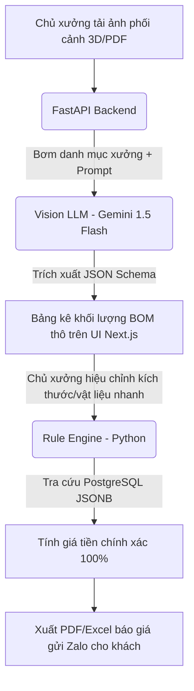

# Kế Hoạch Phát Triển Dự Án Quick-Quote AI (P0)

Tài liệu này chi tiết hóa kiến trúc, nguyên lý hoạt động, kế hoạch xây dựng và lộ trình triển khai module **Quick-Quote AI (P0)** - hệ thống báo giá nhanh dành cho chủ xưởng gỗ nội thất tại Việt Nam dựa trên thảo luận và thống nhất.

---

## 1. Tổng Quan & Luồng Nghiệp Vụ Tối Ưu

Để triệt tiêu các hạn chế về độ chính xác của AI và sự nhiễu loạn thông tin trên bản vẽ phối cảnh 3D/mặt bằng, hệ thống áp dụng luồng nghiệp vụ **"AI-assisted, Human-approved" (AI hỗ trợ, Con người phê duyệt)**:



### Tại sao quy trình này tối ưu?
*   **Tốc độ cực nhanh**: Thay vì mất 45 phút gõ tay Excel, chủ xưởng chỉ mất 30 giây để duyệt bảng BOM thô do AI tạo sẵn và xuất file báo giá.
*   **Chính xác tuyệt đối về số học**: AI chỉ bóc tách thực thể (đếm số lượng, ước lượng kích thước), việc tính tiền do code Python thuần đảm nhận.
*   **Tránh nhiễu**: Lọc bỏ các vật thể phụ (đèn trần, rèm cửa, thiết bị điện) không thuộc phạm vi sản xuất của xưởng.

---

## 2. Kiến Trúc & Thiết Kế Hệ Thống

### Tech Stack
*   **Backend Framework**: Python FastAPI (xử lý async bất đồng bộ).
*   **Database**: PostgreSQL (sử dụng trường `JSONB` để lưu cấu hình bảng giá động của từng xưởng).
*   **AI Layer**: Gemini 1.5 Flash API (ưu tiên số 1 vì chi phí rẻ, tốc độ cao, hỗ trợ tốt hình ảnh) kết hợp cấu hình mở rộng lên Claude 3.5 Sonnet / GPT-4o.
*   **Frontend**: Next.js + TailwindCSS + Shadcn/ui (thiết kế giao diện bảng Excel-like giúp chủ xưởng chỉnh sửa kích thước cực nhanh).

### Cơ chế Async tránh nghẽn I/O & HTTP Timeout
Thời gian phản hồi của Vision LLM khi xử lý ảnh dao động từ 5 - 15 giây. Hệ thống sẽ **không dùng** cơ chế Request-Response đồng bộ truyền thống.
1.  **Client gửi ảnh**: API tiếp nhận, đẩy file vào storage (AWS S3/MinIO), tạo một bản ghi Job trong PostgreSQL và trả về ngay mã trạng thái `202 Accepted` kèm `job_id`.
2.  **Xử lý ngầm (Background Task)**: Backend chạy tác vụ gọi LLM bóc tách ảnh và cập nhật kết quả vào Job.
3.  **Client kiểm tra (Polling/SSE)**: Frontend thực hiện gửi request check trạng thái Job mỗi 2 giây hoặc nhận cập nhật qua Server-Sent Events (SSE). Khi Job hoàn thành, UI tự động hiển thị bảng kết quả.

---

## 3. Thiết Kế AI Layer & Phòng Ngừa Sai Lệch

Để khắc phục việc AI không có kiến thức chuyên sâu ngành mộc (Domain Knowledge) và tránh nhiễu thông tin, chúng ta áp dụng các giải pháp kỹ thuật sau:

### A. Dynamic Prompt Context (Bơm cấu hình xưởng vào Prompt)
Trước khi gọi API LLM, hệ thống sẽ lấy danh sách danh mục sản phẩm mà xưởng đó làm được từ PostgreSQL (`PriceConfig`) và chèn vào prompt:
> *"Bạn là AI hỗ trợ bóc tách mộc. Xưởng này chỉ sản xuất các đồ nội thất gỗ sau: `[Tủ áo, Giường, Kệ tivi, Tủ bếp]`. Hãy bỏ qua tất cả thiết bị điện, đèn trần, rèm cửa, đồ decor trang trí. Nếu có hạng mục gỗ khác nằm ngoài danh sách, phân loại vào mục 'Khác' và cảnh báo."*

### B. Structured Outputs (Ép kiểu JSON Schema)
Sử dụng tính năng **Structured Outputs** của OpenAI/Gemini hoặc Claude Tool Use để ép mô hình trả về đúng định dạng JSON được định nghĩa qua Pydantic ở Backend. AI không được phép trả về chữ tự do (free-form text).

```python
class QuotedItem(BaseModel):
    name: str          # e.g., "Tủ quần áo kịch trần"
    length: float      # Kích thước dài (mm)
    width: float       # Kích thước rộng/cao (mm)
    depth: float       # Chiều sâu (mm)
    wood_type: str     # Cốt gỗ/bề mặt thô nhận diện được
    quantity: int = 1
    category: str      # Phân loại để map bảng giá
```

### C. Quy tắc mộc chuẩn Việt Nam (Carpentry Rules Prompting)
Dạy AI các kích thước tiêu chuẩn ngầm định trong Prompt để điền vào chỗ trống khi ảnh không hiển thị góc khuất:
*   Độ sâu mặc định của tủ áo, tủ bếp dưới là $600\text{mm}$.
*   Độ sâu tủ bếp trên mặc định là $350\text{mm}$.
*   Giường ngủ đôi mặc định kích thước $1800\text{mm} \times 2000\text{mm}$.
*   Mọi kích thước ước lượng phải làm tròn chia hết cho $50\text{mm}$ hoặc $100\text{mm}$.

---

## 4. Thiết Kế Rule Engine & Lưu Trữ PostgreSQL JSONB

### Thiết kế Cơ sở dữ liệu Bảng giá động
Mỗi xưởng gỗ có bảng giá vật tư hoàn toàn khác nhau. Chúng ta lưu trữ cấu hình này dưới dạng một trường `JSONB` trong bảng `workshop_pricing`:

```sql
CREATE TABLE workshop_pricing (
    id SERIAL PRIMARY KEY,
    workshop_id VARCHAR(50) NOT NULL UNIQUE,
    pricing_config JSONB NOT NULL,
    created_at TIMESTAMP DEFAULT CURRENT_TIMESTAMP
);
```

#### Cấu trúc JSONB chuẩn:
```json
{
  "categories": [
    {
      "category": "Tủ áo",
      "unit": "m2",
      "prices": {
        "mdf_melamine": 2200000,
        "mdf_acrylic": 2800000
      },
      "keywords": ["tủ áo", "quần áo", "tủ đồ"]
    },
    {
      "category": "Tủ bếp dưới",
      "unit": "md",
      "prices": {
        "mdf_melamine": 2400000,
        "mdf_acrylic": 3200000
      },
      "keywords": ["tủ bếp dưới", "bếp dưới"]
    }
  ],
  "default_unit_prices": {
    "md": 2000000,
    "m2": 2200000,
    "cái": 3000000
  }
}
```

### Logic Tính Tiền của Rule Engine (Python thuần)
*   **Fuzzy Name Matching**: So khớp không phân biệt chữ hoa chữ thường và dựa trên bộ `keywords` để tự động map tên do AI bóc tách (e.g. *"Tủ quần áo cánh kính"*) vào nhóm danh mục của xưởng (e.g. *"Tủ áo"*).
*   **Phép tính theo đơn vị đo**:
    *   **Mét dài (`md`)**: $\text{Dài (m)} \times \text{Đơn giá} \times \text{Số lượng}$ (Dành cho tủ bếp, kệ trang trí dài).
    *   **Mét vuông (`m2`)**: $\text{Dài (m)} \times \text{Rộng (m)} \times \text{Đơn giá} \times \text{Số lượng}$ (Dành cho tủ quần áo, vách ốp đầu giường).
    *   **Cái/Bộ**: $\text{Đơn giá} \times \text{Số lượng}$ (Dành cho giường ngủ, bàn trang điểm, tab đầu giường).
*   **Làm tròn tiền mặt**: Toàn bộ giá tiền làm tròn về số nguyên gần nhất (không sử dụng phần thập phân vì đơn vị tiền là VND).

---

## 5. Giải Pháp Onboarding Giảm Friction (Lực Cản Đăng Ký)

Chủ xưởng gỗ nhỏ không có sẵn bảng giá định hình tốt. Để giảm lực cản khi họ bắt đầu sử dụng app, hệ thống sẽ:
1.  **Cung cấp sẵn các Mẫu bảng giá tiêu chuẩn (Preset Templates)** khi đăng ký tài khoản:
    *   *Template Bình dân*: Tính giá theo cốt ván chợ giá rẻ.
    *   *Template Phổ thông*: Sử dụng ván phủ Melamine của hãng Thái Lan hoặc Minh Long/Dongwha.
    *   *Template Cao cấp*: Sử dụng ván MDF/HDF chống ẩm cao cấp của hãng An Cường.
2.  Chủ xưởng chỉ cần chọn mẫu phù hợp nhất và thay đổi nhanh một vài đơn giá cốt lõi trên màn hình quản trị bằng giao diện chỉnh sửa nhanh trước khi bắt đầu quét ảnh.

---

## 6. Lộ Trình Triển Khai Phát Triển (Lũy Tiến 4 Tuần)

### Tuần 1: Lõi tính toán (Domain & Rule Engine)
*   Định nghĩa thực thể Domain Model bằng Pydantic.
*   Lập trình Rule Engine tính giá m2, md, cái kèm logic so khớp chuỗi thông minh (Vietnamese fuzzy match).
*   Viết Unit Test kiểm thử tất cả các trường hợp làm tròn số, fallback giá khi vật liệu lạ.

### Tuần 2: Tích hợp AI Layer (Vision LLM Integrations)
*   Xây dựng prompt tối ưu cho Gemini 1.5 Flash / GPT-4o.
*   Cấu hình cơ chế Structured Outputs đảm bảo dữ liệu thô trả về 100% khớp JSON Schema.
*   Lập trình cơ chế động: Lấy danh mục xưởng từ DB ghép vào System Prompt trước khi gọi AI.

### Tuần 3: Pipeline Xử lý Async & Database
*   Thiết kế bảng PostgreSQL lưu trữ bảng giá xưởng (`JSONB`) và lịch sử báo giá.
*   Viết API Endpoint nhận file, lưu trữ file lên cloud storage.
*   Triển khai cơ chế xử lý Job ngầm (FastAPI Background Tasks) và API Polling lấy trạng thái.

### Tuần 4: Giao Diện Frontend Next.js & Xuất Báo Giá
*   Phát triển UI kéo thả ảnh, màn hình chờ xử lý Job bất đồng bộ.
*   Xây dựng bảng Excel-like cho phép sửa trực tiếp số lượng, kích thước mộc do AI bóc tách.
*   Tích hợp thư viện xuất báo giá PDF chuyên nghiệp gửi Zalo.
