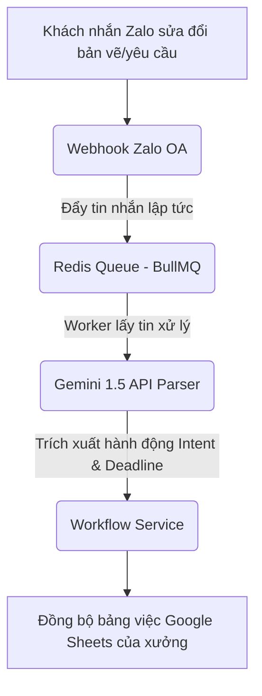
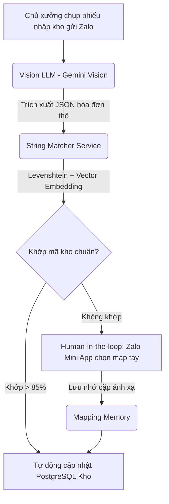

# Kế Hoạch Phát Triển Dự Án AI Office - Zalo Workflow & Inventory Agent (P1)

Tài liệu này chi tiết hóa kiến trúc, nguyên lý hoạt động, kế hoạch xây dựng và lộ trình triển khai module **AI Office (P1)** - trợ lý ảo tích hợp hệ sinh thái Zalo để quản lý luồng công việc tự động và tối ưu hóa nhập kho cho chủ xưởng gỗ Việt Nam.

---

## 1. Tổng Quan & Luồng Nghiệp Vụ Tối Ưu

Sản phẩm P1 giải quyết bài toán trôi tin nhắn trên Zalo khi khách hàng thay đổi yêu cầu liên tục, đồng thời tự động hóa khâu nhập kho vật tư từ hóa đơn giấy hỗn loạn bằng hai luồng nghiệp vụ chính:

### Luồng 1: Quản lý luồng việc (Zalo OA Task Workflow)


### Luồng 2: Tự động hóa nhập kho (Inventory Auto-Mapping)


---

## 2. Kiến Trúc & Thiết Kế Hệ Thống (Modular Decoupled Monolith)

P1 chạy song song và kết nối chung database PostgreSQL với P0 nhằm tối ưu chi phí vận hành và đồng bộ dữ liệu.

### Tech Stack
*   **Backend Framework**: Node.js (NestJS / TypeScript) - Cấu trúc mô-đun hóa độc lập (Decoupled modules), rất phù hợp để xây dựng cổng webhook và API tích hợp Zalo/Google Sheets.
*   **Queue System**: BullMQ + Redis (Bảo vệ hệ thống tránh nuốt tin nhắn khi Zalo đẩy Webhook dồn dập và xử lý bất đồng bộ các ảnh hóa đơn nặng).
*   **AI Layer**: Gemini 1.5 Flash / Pro API (Chi phí tối ưu, cửa sổ ngữ cảnh cực lớn để đọc luồng chat dài) kết hợp Text Embedding Model phục vụ so khớp vật tư.
*   **Integrations**: Zalo OA API, Google Sheets API.

---

## 3. Chi Tiết Kỹ Thuật AI Layer & Xử Lý Dữ Liệu Hỗn Loạn

### A. AI Parser phân tách Ý định (Intent & OCR)
*   **Xử lý văn bản (Tin nhắn)**: Prompt của Gemini được thiết kế để phân loại mục đích tin nhắn: `[Sửa bản vẽ, Giao việc, Thay đổi màu sắc, Hẹn lịch]`.
*   **Xử lý hình ảnh (Phiếu mua hàng)**: Sử dụng Gemini Vision API để bóc tách ảnh hóa đơn nhà cung cấp thành cấu trúc JSON:
    ```json
    {
      "invoice_id": "HD-12345",
      "items": [
        {"raw_name": "MDF LX 17mm chống ẩm", "quantity": 10, "unit_price": 280000}
      ]
    }
    ```

### B. Module So Khớp Vật Tư (String Matcher & Memory)
Tên vật tư trên hóa đơn viết rất hỗn loạn (Ví dụ: *"Ván MDF LX 17"* so với tên chuẩn trong DB xưởng là *"MDF chống ẩm 17ly"*).
1.  **Khoảng cách Levenshtein**: Tính toán sự tương đồng ký tự giữa `raw_name` và danh mục chuẩn.
2.  **Vector Embedding (Semantics)**: Chuyển đổi tên vật tư thành Vector để tính toán độ tương đồng cosine (e.g. *"Ván 17ly"* đồng nghĩa với *"MDF 17mm"*).
3.  **Mapping Memory (Bộ nhớ ánh xạ)**: Lưu trữ các cặp tên đã được map thành công vào bảng lưu nhớ của PostgreSQL. Những lần nhập sau sẽ lấy trực tiếp từ đây mà không cần chạy lại AI/Embedding.

---

## 4. Giải Pháp Tránh Nghẽn Tài Nguyên (CPU-Bound & Platform Timeout)

### A. Giải quyết nghẽn CPU-Bound do ảnh nặng
Chủ xưởng chụp ảnh hóa đơn độ phân giải cao hoặc gửi file bản vẽ kỹ thuật nặng (50MB) có thể chiếm dụng 100% CPU của máy chủ đơn nhân (VPS giá rẻ).
*   **Giải pháp**: Tách biệt luồng Webhook Zalo. Khi Webhook nhận dữ liệu, nó chỉ đẩy payload vào **BullMQ + Redis** và trả ngay trạng thái `202 Accepted` cho Zalo trong vòng **500ms** (tránh việc Zalo timeout và bắn lại tin trùng lặp). Việc xử lý ảnh nặng và gọi AI sẽ do một Background Worker độc lập xử lý ngầm.

### B. Giải pháp Human-in-the-loop (HITL) cho Mã hàng lạ
Khi thuật toán Levenshtein và Embedding không tìm thấy mã kho phù hợp (độ tin cậy < 85%):
1.  Hệ thống kích hoạt luồng duyệt tay.
2.  Gửi tin nhắn thông báo về điện thoại của chủ xưởng kèm link **Mini App Zalo**.
3.  Chủ xưởng mở Mini App, giao diện hiển thị: *"Hệ thống phát hiện mã lạ: 'MDF LX 17'. Hãy chọn mã kho chuẩn tương ứng..."*
4.  Khi chủ xưởng xác nhận map vào *"MDF chống ẩm 17ly"*, cặp này sẽ được ghi vào `Mapping Memory` để tự động chạy ở các hóa đơn sau.

---

## 5. Lộ Trình Triển Khai Phát Triển (Lũy Tiến 3 Tuần)

### Tuần 1: Webhook & Hàng đợi bảo vệ luồng I/O
*   Đăng ký Zalo OA Developer portal, cấu hình Webhook URL.
*   Thiết lập Redis và hàng đợi BullMQ trong NestJS.
*   Viết endpoint tiếp nhận tin nhắn, phân tải đẩy vào Queue và phản hồi nhanh trạng thái 202.

### Tuần 2: Xử lý AI & Thuật toán So Khớp
*   Thiết kế prompt trích xuất hóa đơn cho Gemini Vision API.
*   Lập trình service `string_matcher` kết hợp Levenshtein Distance và Embedding Model.
*   Thiết kế cấu trúc bảng lưu trữ ánh xạ `Mapping Memory` trong PostgreSQL.

### Tuần 3: Đồng bộ bên ngoài & Zalo Mini App
*   Tích hợp Google Sheets API để ghi chép tự động nhật ký công việc của thợ.
*   Xây dựng giao diện Zalo Mini App tối giản cho chủ xưởng duyệt tay các mã hàng chưa khớp.
*   Đóng gói Docker, triển khai thử nghiệm thực tế.
