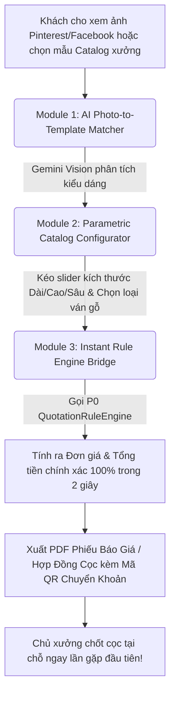

# Kế Hoạch Phát Triển Dự Án Mobile Showroom & Instant Parametric Quotation Platform (P2)

Tài liệu này chi tiết hóa kiến trúc, nguyên lý hoạt động, kế hoạch xây dựng và lộ trình triển khai cụm dịch vụ **Mobile Showroom & Instant Parametric Quotation Platform (P2)** - nền tảng thư viện mẫu mộc di động và báo giá tham số hóa tức thì giúp chủ xưởng gỗ tư vấn, nhảy báo giá chính xác và chốt hợp đồng cọc ngay tại công trình/buổi gặp đầu tiên với khách hàng.

---

## 1. Phân Tích Pain Point Thực Tế Khi Nguồn Khách Hàng Bị Rò Rỉ

Qua khảo sát thực tế quy trình chốt hợp đồng của các chủ xưởng mộc tại Việt Nam, bài toán gây tổn thất doanh thu lớn nhất nằm ở **KHÂU TƯ VẤN & BÁO GIÁ LẦN ĐẦU GẶP KHÁCH**:

### Kịch bản thực tế thường gặp:
1. Chủ xưởng mang thước dây đến căn hộ chung cư thô / công trình để gặp chủ nhà.
2. Chủ nhà giơ điện thoại cho xem ảnh tủ áo/tủ bếp trên Pinterest/Facebook và hỏi: *"Căn này của anh tủ áo dài 2.4m kịch trần, làm bằng gỗ MDF chống ẩm An Cường phủ Melamine thì khoảng bao nhiêu tiền?"*.
3. Chủ xưởng **không có công cụ tính giá nhanh tại chỗ**, đành hẹn: *"Về em bảo KTS vẽ phối cảnh 3D rồi em làm file Excel báo giá gửi anh sau 2 ngày nhé"*.
4. **Hậu quả**: Trong 2 ngày chờ đợi đó:
   * Khách hàng nguội lạnh cảm xúc.
   * Đối thủ (xưởng khác) tiếp cận, báo giá nhanh hơn và **chốt cọc hợp đồng mất**.
   * Xưởng tốn công KTS vẽ 3D miễn phí nhưng khách không làm $\rightarrow$ Lãng phí chi phí cơ hội và nhân công.

---

## 2. Giải Pháp P2: Mobile Showroom & Báo Giá Tham Số Hóa Tức Thì

---

## 3. Các Phân Hệ Tính Năng Cốt Lõi

### Module 1: AI Photo-to-Template Matcher (Phân Tích Ảnh Pinterest / Facebook)
Khi khách hàng đưa ảnh bất kỳ trên mạng:
* Chủ xưởng chụp lại hoặc tải ảnh lên App.
* **Vision LLM (Gemini 1.5 Flash)** tự động phân loại kiểu dáng: `[Tủ áo kịch trần cánh mở, Tủ bếp chữ L, Giường bọc nệm, Kệ tivi treo]`.
* Tự động trích xuất màu sắc ván mộc mẫu và map trực tiếp với mã mẫu mộc tương ứng trong Catalog của xưởng.

### Module 2: Parametric Catalog Configurator (Thư Viện Mẫu Mộc Tham Số Hóa)
Bộ Catalog mộc chuẩn hóa của xưởng hiển thị mượt mà trên Tablet/Điện thoại di động:
* **Slider Kích thước Tham số (Parametric Sliders)**:
  * Chiều dài: $1200\text{mm} \rightarrow 4000\text{mm}$ (Bước nhảy $50\text{mm}$).
  * Chiều cao: $2000\text{mm} \rightarrow 2800\text{mm}$ (Mặc định tự gợi ý kịch trần).
  * Chiều sâu: $350\text{mm} \rightarrow 650\text{mm}$ (Phù hợp chuẩn mộc từng loại tủ).
* **Bộ chọn Vật liệu & Thương hiệu Ván (Material Selectors)**:
  * Cốt gỗ: MDF chống ẩm / HDF / Plywood / Gỗ ghép thanh.
  * Hãng ván: An Cường / Minh Long / ThaiTex / Ba Thanh.
  * Bề mặt phủ: Melamine / Acrylic bóng gương / Laminate / Veneer xoan đào, óc chó.
  * Thương hiệu phụ kiện: Hafele / Blum / DTC / Eurogold.

### Module 3: Instant Quotation & Contract Deposit Generator (Báo Giá & Hợp Đồng Cọc Tại Chỗ)
* Tích hợp trực tiếp với **`QuotationRuleEngine` của P0**:
  * Tự động nhân diện tích $m^2$ hoặc $md$ với đơn giá xưởng trong `WorkshopPricingConfig`.
  * Hiển thị bảng tổng hợp giá tiền chi tiết chỉ sau **2 giây**.
* **Xuất Hợp đồng đặt cọc nhanh (PDF)**:
  * Điền nhanh thông tin khách hàng, địa chỉ công trình và số tiền cọc (e.g. $10\% - 20\%$).
  * Tự động sinh mã **VietQR** chuyển khoản ngân hàng trực tiếp vào tài khoản xưởng để khách quét QR chốt cọc ngay lập tức.

---

## 4. Kiến Trúc Kỹ Thuật & Tech Stack

P2 được thiết kế ưu tiên trải nghiệm di động (**Mobile-First PWA**), chạy cực nhanh và có khả năng hoạt động ngay cả khi sóng mạng tại công trình yếu:

### Tech Stack
* **Frontend**: React.js / Next.js PWA (Hỗ trợ offline caching danh mục mộc, hiển thị mượt mà trên iPad, Samsung Tab, iPhone).
* **Backend API Gateway**: Python FastAPI (`mobile_showroom_server`).
* **AI Layer**: Gemini 1.5 Flash API (Tốc độ phản hồi phân tích ảnh $< 2$ giây, chi phí cực rẻ).
* **Payment & Contract**: PDFKit / ReportLab sinh file PDF hợp đồng cọc + VietQR API sinh mã QR thanh toán ngân hàng.

---

## 5. Lộ Trình Triển Khai Phát Triển (Lũy Tiến 4 Tuần)

### Tuần 1: Cấu Trúc Catalog Tham Số Hóa & Giao Diện Tablet
* Thiết kế Pydantic Schema cho `ParametricTemplate` (Tủ áo, Tủ bếp, Giường, Kệ).
* Xây dựng giao diện Web PWA di động với các thanh slider điều chỉnh kích thước mượt mà.

### Tuần 2: Tích Hợp AI Matcher (Photo-to-Template)
* Viết Prompt cho Gemini Vision phân loại kiểu dáng mộc từ ảnh khách hàng (Pinterest/Facebook).
* Tự động map từ kết quả AI sang Template Catalog phù hợp của xưởng.

### Tuần 3: Kết Nối Lõi Tính Giá P0 & Sinh Hợp Đồng Cọc PDF
* Tích hợp `QuotationRuleEngine` từ P0 để tính toán giá tiền chính xác 100% dựa trên bảng giá xưởng.
* Lập trình module xuất file PDF Báo Giá / Hợp Đồng Cọc thương hiệu xưởng + Tích hợp VietQR.

### Tuần 4: Thử Nghiệm Thực Tế & Tối Ưu Trải Nghiệm Khách Hàng
* Đóng gói Docker, triển khai PWA app.
* Thử nghiệm thực tế cùng chủ xưởng khi đi gặp khách hàng tại công trình.
