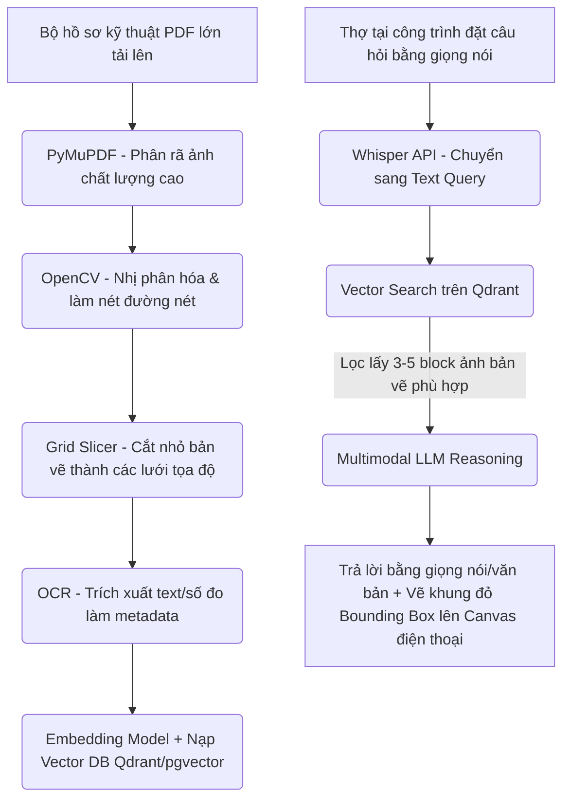

# Kế Hoạch Phát Triển Dự Án Drawing Copilot - Vision-RAG Platform (P2)

Tài liệu này chi tiết hóa kiến trúc, nguyên lý hoạt động, kế hoạch xây dựng và lộ trình triển khai cụm dịch vụ **Drawing Copilot (P2)** - trợ lý ảo đa phương thức hỗ trợ kỹ sư và thợ lắp ráp tại công trình hỏi đáp trực tiếp bằng giọng nói trên bản vẽ kỹ thuật phức tạp.

---

## 1. Tổng Quan & Luồng Nghiệp Vụ Tối Ưu

Sản phẩm P2 giải quyết bài toán đọc sai thông số bản vẽ giấy khổ lớn tại công trường của thợ lắp ráp, gây lỗi lắp đặt dẫn tới phá dỡ đền bù tài chính. Luồng nghiệp vụ của Drawing Copilot được vận hành như sau:



---

## 2. Kiến Trúc & Thiết Kế Hệ Thống (Microservices)

Do đặc thù xử lý đồ họa nặng, bẻ tách tập tin PDF A3/A0 và tính toán Vector cực kỳ tốn RAM/CPU, P2 được **cô lập hoàn toàn thành cụm Microservice độc lập** để tránh làm treo hệ thống Web bán hàng/báo giá của P0/P1.

### Phân rã Services
1.  **drawing_gateway (Node.js/NestJS)**: API Gateway tiếp nhận file bản vẽ, xử lý xác thực người dùng, lưu trữ thông tin dự án và quản lý điều phối tải.
2.  **drawing_rag_engine (Python FastAPI)**: Microservice tính toán nặng chuyên dụng. Xử lý OpenCV, phân tích bản vẽ kỹ thuật, kết nối Vector DB và chạy luồng truy vấn RAG.

### Tech Stack
*   **Frontend**: React.js Mobile-first / Next.js PWA (Hỗ trợ ghi âm microphone ghi đè ngoại tuyến, dựng thẻ HTML Canvas để vẽ bounding box tương tác).
*   **Vector Database**: Qdrant hoặc pgvector (tối ưu hóa lưu trữ tọa độ ma trận không gian).
*   **Heavy Processing Libraries**: PyMuPDF (đọc file PDF kỹ thuật), OpenCV (xử lý hình ảnh nhị phân), OpenAI Whisper API (chuyển đổi Speech-to-Text độ trễ thấp).

---

## 3. Chi Tiết Kỹ Thuật Pipeline Nạp Bản Vẽ (Ingestion Pipeline)

Để triệt tiêu lỗi **ảo giác số đo** (AI đọc nhầm số kích thước nhỏ nằm sát nhau, ví dụ $1100\text{mm}$ đọc thành $1000\text{mm}$), hệ thống áp dụng pipeline xử lý ảnh nâng cao:

### Bước 1: Tiền xử lý ảnh kỹ thuật (OpenCV Image Processing)
*   Chuyển đổi trang bản vẽ PDF sang ảnh chất lượng cao 300 DPI.
*   Áp dụng thuật toán lọc nhị phân **Adaptive Thresholding** để loại bỏ các điểm mờ, tăng độ nét cho các nét vẽ CAD mảnh và làm rõ nét chữ số kích thước.

### Bước 2: Cắt lát Không gian (Grid Slicing) & Trích xuất Metadata
*   Cắt bản vẽ thành các phân mảnh nhỏ (ví dụ lưới $4 \times 4$ hoặc $8 \times 8$) tương ứng với các tọa độ góc $(x_1, y_1, x_2, y_2)$.
*   Chạy công cụ OCR (ví dụ Tesseract hoặc Google Vision OCR) trên từng phân mảnh để lấy từ khóa văn bản và các chữ số kích thước nằm trong mảnh đó.
*   **Định dạng Vector DB Entry**:
    ```json
    {
      "vector": [0.12, -0.45, 0.89, "..."],
      "metadata": {
        "project_id": "proj_99",
        "page_number": 5,
        "bounding_box": [100, 150, 400, 450],
        "extracted_text": "tủ bếp dưới hộc kéo máy rửa bát bosch kích thước 600",
        "image_slice_url": "s3://.../slice_5_1.png"
      }
    }
    ```

---

## 4. Chi Tiết Kỹ Thuật Luồng Truy Vấn (Query & RAG Pipeline)

1.  **Speech-to-Text**: Thợ nhấn nút ghi âm trên điện thoại và hỏi: *"Kích thước của khoang để máy rửa bát là bao nhiêu?"*. Whisper API trả về văn bản truy vấn.
2.  **Vector Search**: Dùng câu hỏi để thực hiện truy vấn tương đồng ngữ nghĩa trên Qdrant DB. Lọc ra 3 mảnh bản vẽ chứa hình ảnh của khu vực tủ bếp và có từ khóa "máy rửa bát" trong metadata.
3.  **Vision-RAG Reasoning**: Gửi đồng thời câu hỏi dạng text cùng 3 mảnh ảnh nhỏ này vào Multimodal LLM (e.g. GPT-4o / Gemini 1.5 Pro). Mô hình sẽ tập trung đọc các con số ghi trên bản vẽ phân mảnh để trả lời chính xác: *"Kích thước lọt lòng của khoang máy rửa bát là 600mm."*
4.  **Spatial Highlighting**: LLM trả về tọa độ Bounding Box của con số đó. Client React sử dụng thẻ Canvas vẽ một ô chữ nhật đỏ khoanh đúng vị trí con số trên bản vẽ tổng thể hiển thị trên màn hình điện thoại của thợ, giúp họ xác minh trực quan ngay lập tức.

---

## 5. Lộ Trình Triển Khai Phát Triển (Lũy Tiến 8 - 12 Tuần)

### Giai đoạn 1 (Tuần 1 - 3): Heavy Graphics & Processing Service
*   Thiết lập dự án `drawing_rag_engine` bằng Python FastAPI.
*   Tích hợp PyMuPDF giải nén bản vẽ và OpenCV tiền xử lý lọc nhị phân làm nét chữ.
*   Viết module Grid Slicer cắt lát bản vẽ theo tọa độ lưới.

### Giai đoạn 2 (Tuần 4 - 6): Vector DB & OCR Integration
*   Cài đặt Qdrant Vector Database.
*   Lập trình pipeline OCR trích xuất chữ và số đo trên từng phân mảnh mộc.
*   Thực hiện vector hóa văn bản và đồng bộ toàn bộ siêu dữ liệu (metadata) tọa độ vào DB.

### Giai đoạn 3 (Tuần 7 - 9): Giọng nói & Giao diện hiện trường PWA
*   Tạo PWA di động (React.js) hỗ trợ ghi âm trực tiếp tại công trường.
*   Tích hợp Whisper API để nhận diện giọng nói tiếng Việt chuyên ngành mộc (e.g. đọc đúng các từ lọt lòng, thông thủy, phào chỉ, bản lề...).
*   Xây dựng Canvas Renderer hiển thị bản vẽ kỹ thuật và hỗ trợ vẽ Bounding Box màu đỏ.

### Giai đoạn 4 (Tuần 10 - 12): Tích hợp toàn diện & Tối ưu hóa tải
*   Kết nối API Gateway (NestJS) điều phối tải.
*   Dockerize toàn bộ dịch vụ và triển khai trên cụm máy chủ compute riêng biệt.
*   Tối ưu hóa tốc độ phản hồi từ lúc thợ hỏi bằng giọng nói đến khi hiển thị kết quả vẽ khung đỏ dưới 3 giây.
