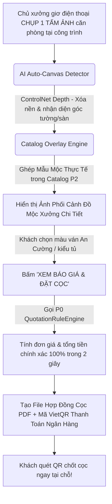
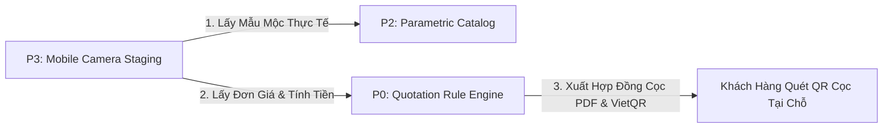

# Kế Hoạch Phát Triển Dự Án AI Auto-Staging & Instant Deposit Platform (P3)

Tài liệu này chi tiết hóa kiến trúc, nguyên lý hoạt động, kế hoạch xây dựng và lộ trình triển khai cụm dịch vụ **AI Auto-Staging & Instant Deposit Platform (P3)** - công cụ chụp ảnh không gian căn phòng và tự động lót các mẫu mộc thực tế của xưởng để chốt cọc hợp đồng ngay tại công trình.

---

## 1. Triết Lý Sản Phẩm & Điểm Đột Phá Bóp Chết Mọi Đối Thủ

### 🚨 Vấn đề của các App AI khác trên thị trường (như Interior AI, Remodel AI):
* Tạo ra các bức ảnh phối cảnh 3D ảo rất đẹp mắt nhờ Generative AI truyền thống.
* **NHƯNG ĐỒ TRONG ẢNH LÀ HÌNH VẼ ẢO**, không có kích thước thực tế, không có trong catalog xưởng và **KHÔNG THỂ SẢN XUẤT ĐƯỢC**. Khách thích ảnh ảo nhưng xưởng mộc bó tay không đóng được.

### 🎯 Điểm Đột Phá Bóp Chết Mọi Đối Thủ Của P3:
* **Mọi món đồ mộc mà AI lót vào căn phòng ĐỀU LÀ MẪU MỘC THỰC TẾ TRONG CATALOG CỦA XƯỞNG (P2)**.
* **Luồng UX Tối Đơn (Single-Stream Flow)**:
  1. Chủ xưởng giơ điện thoại **CHỤP 1 TẤM ẢNH GÓC PHÒNG** tại công trình.
  2. AI tự động nhận diện khung không gian (Nếu phòng có đồ cũ, AI tự tẩy nét đè nền coi như mặt bằng phòng trống).
  3. AI lót bộ Mẫu Mộc Thực Tế từ Catalog xưởng vào góc tường/sàn nhà.
  4. Khách lướt đổi các màu ván gỗ An Cường / kiểu dáng tủ.
  5. Bấm **"TÍNH GIÁ"** $\rightarrow$ Hệ thống lấy kích thước căn phòng $\times$ Đơn giá xưởng P0 $\rightarrow$ Nhảy ra **Hợp đồng cọc PDF kèm mã VietQR** để khách quét thanh toán cọc ngay tại chỗ!

---

## 2. Luồng Nghiệp Vụ Tối Ưu "Hybrid Photo-AI Staging"

---

## 3. Kiến Trúc Kỹ Thuật & Tích Hợp Hệ Thống

P3 được xây dựng như một **Tầng Trải Nghiệm Thị Giác Chốt Sales (Sales Visual Layer)** kết nối trực tiếp với lõi P0 và P2:

### Tech Stack
* **Frontend Mobile Client**: React.js PWA Camera (Nén ảnh tại máy client, chụp ảnh sắc nét, lướt catalog mượt mà trên di động/tablet).
* **AI Canvas Engine**: Python FastAPI (`staging_engine`), ControlNet Depth Map, OpenCV Perspective Estimation.
* **GPU Cloud**: API Serverless (`fal.ai` / Replicate) giai đoạn MVP $\rightarrow$ Dedicated GPU Server (RunPod RTX 4090) khi scale quy mô.
* **Payment & Contract**: PDFKit sinh file Hợp đồng cọc + VietQR API sinh mã QR thanh toán ngân hàng.

---

## 4. Lộ Trình Triển Khai Phát Triển (Lũy Tiến 4 Tuần)

### Tuần 1: Mobile Camera PWA & OpenCV Canvas Detection
* Xây dựng giao diện chụp ảnh trên di động PWA mượt mà.
* Lập trình module OpenCV / ControlNet Depth nhận diện mặt sàn và tường chính của căn phòng.

### Tuần 2: Module Lót Mẫu Mộc Catalog P2 Vào Không Gian Ảo
* Tích hợp bộ Catalog tham số từ P2 (Tủ áo, Tủ bếp, Giường ngủ).
* Lập trình thuật toán ghép mẫu mộc thực tế vào vị trí căn phòng theo đúng tỷ lệ và góc nhìn.

### Tuần 3: Tích Hợp Lõi Tính Giá P0 & Sinh Hợp Đồng Cọc VietQR
* Kết nối tự động với `QuotationRuleEngine` của P0.
* Tính tiền chính xác $100\%$ và sinh file PDF Hợp Đồng Đặt Cọc kèm mã VietQR chuyển khoản.

### Tuần 4: Tối Ưu Tốc Độ Processing (< 3 Giây) & Thử Nghiệm Thực Tế
* Tối ưu hóa pipeline GPU đảm bảo thời gian từ lúc chụp ảnh đến khi ra báo giá dưới 3 giây.
* Đóng gói Docker và chạy thử nghiệm thực tế cùng 2-3 chủ xưởng gỗ tại công trình.
